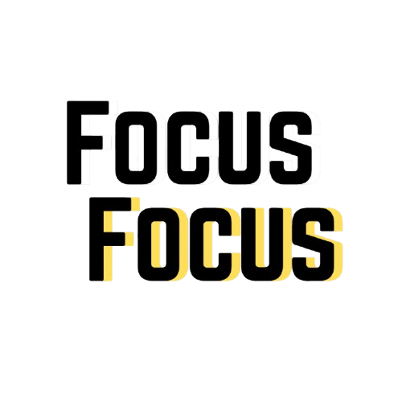
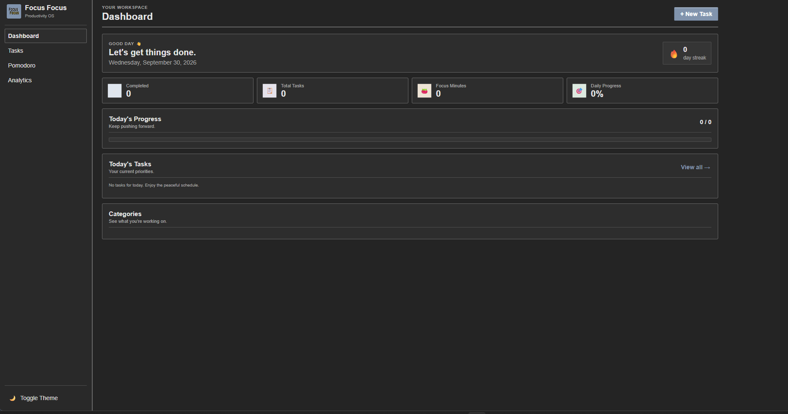

# Focus Focus 


Focus Focus is a simple and easy-to-use productivity OS designed to keep the things you need to do in one place.

It includes a TODO list, Pomodoro timer, Eisenhower Method, and category-based sorting without trying to make productivity unnecessarily complicated.

Focus Focus was made for **Hack Club Stardance**.

## Preview

<!-- Add your website screenshot here -->

<!-- Replace the path below with the location of your screenshot -->



## Features

### TODO List

Add tasks and keep track of what needs to be done.

### Pomodoro Timer

A built-in Pomodoro timer for working in focused sessions with breaks.

### Eisenhower Method

The TODO list includes the Eisenhower Method, allowing tasks to be organized based on their importance and urgency.

### Category-Based Sorting

Tasks can be organized into categories, making it easier to find what you're looking for.

### Simple Interface

The goal was to keep the interface straightforward and easy to use instead of filling it with unnecessary features.

## The Code Stuff

Focus Focus is built using three main web technologies:

* HTML
* CSS
* JavaScript

### HTML

The HTML was built by me and is responsible for the structure of the application.

### CSS

CSS was the part where I needed the most help.

I've been learning HTML and CSS for around two years, while also spending a lot of time learning electronics, robotics, and other things. I used AI to get some help with the CSS, but I rewrote and changed it myself rather than just using the generated code as-is.

I'm still learning CSS, so this project is also part of that learning process.

### JavaScript

The JavaScript was written by me.

I mainly used AI for debugging and fixing problems when something wasn't working correctly. I did not use AI to generate the main JavaScript code for the project.

## AI Usage

AI was used during development, but it didn't build the project for me.

I used it mainly for:

* Getting some help with CSS
* Debugging JavaScript
* Finding bugs
* Figuring out why something wasn't working

The HTML was built by me, the JavaScript was written by me, and the CSS was edited and rewritten by me after getting some assistance.

I wanted to actually learn from the project rather than just generate a website and call it finished.

## Running It

Focus Focus is a frontend web project, so there isn't a complicated setup process.

Clone the repository:

```bash
git clone https://github.com/afrazakbar/Productivity-tracker
```

Then open the project folder and open the main HTML file in your browser.

That's it.

## Project Structure

```text
Focus-Focus/
│
├── index.html
├── style.css
├── script.js
└── imagers/
    └── focus-focus-preview.png
    └── logo.png
```

The exact structure may change as the project develops.

## Why I Made It

I wanted to build something that was actually useful while also getting more experience with web development.

I've been learning HTML and CSS for around two years, but a lot of my time has also gone into electronics and robotics. Focus Focus gave me a reason to work on web development while building something I could actually use.

It also gave me a chance to work on UI design, JavaScript, task management, and putting several different features together into one project.

## Hack Club Stardance

Focus Focus was made for **Hack Club Stardance**.

Stardance gave me a reason to turn the idea into an actual project instead of leaving it as another project idea sitting around in my notes.

## Future Plans

Some things I'd like to improve in the future include:

* Better task management
* More customization
* Improved mobile support
* Productivity statistics
* More ways to organize tasks
* UI improvements
* More Pomodoro timer options

The project is still being worked on, so this list may change over time.

## Credits

Made by **Afraz Akbar**.

Built with HTML, CSS, and JavaScript.

Made for **Hack Club Stardance**.
